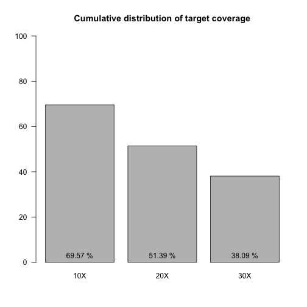

Report for Project: BPIPE WORKSHOP
==========================================

*Analysis by davide.rambaldi@gmail.com*

---

### Table of Contents

* [Project Overview](#overview)
* [Data Quality](#quality)


```r
library(xtable)
hsmetrics_data <- read.delim("samples_hsmetrics.txt", stringsAsFactors=FALSE, row.names=1)
```

# <a name="overview"></a> OVERVIEW

### Improving Flip-Flop Gates and Scheme

##### Abstract

Simulated annealing and telephony, while appropriate in theory, have not until recently been considered private. After years of important research into redundancy, we confirm the investigation of neural networks. In this paper, we use pseudorandom theory to verify that the little-known ambimorphic algorithm for the simulation of the partition table runs in Θ(logn) time.

#####  Introduction

Recent advances in modular algorithms and extensible archetypes do not necessarily obviate the need for voice-over-IP. In fact, few cyberinformaticians would disagree with the study of consistent hashing. Despite the fact that this outcome is always a private aim, it fell in line with our expectations. Therefore, mobile configurations and semaphores agree in order to achieve the development of the Internet.

##### Results and Analysis

We now discuss our evaluation. Our overall performance analysis seeks to prove three hypotheses: (1) that block size stayed constant across successive generations of Commodore 64s; (2) that the Apple Newton of yesteryear actually exhibits better complexity than today's hardware; and finally (3) that RAM speed behaves fundamentally differently on our ubiquitous overlay network. Our work in this regard is a novel contribution, in and of itself.


# <a name="quality"></a> QUALITY


```r
print(xtable(hsmetrics_data, align=rep("c",ncol(hsmetrics_data)+1)), type="html", include.rownames=TRUE)
```

<!-- html table generated in R 3.1.0 by xtable 1.7-3 package -->
<!-- Thu Sep 11 11:56:03 2014 -->
<TABLE border=1>
<TR> <TH>  </TH> <TH> BAIT_SET </TH> <TH> GENOME_SIZE </TH> <TH> BAIT_TERRITORY </TH> <TH> TARGET_TERRITORY </TH> <TH> BAIT_DESIGN_EFFICIENCY </TH> <TH> TOTAL_READS </TH> <TH> PF_READS </TH> <TH> PF_UNIQUE_READS </TH> <TH> PCT_PF_READS </TH> <TH> PCT_PF_UQ_READS </TH> <TH> PF_UQ_READS_ALIGNED </TH> <TH> PCT_PF_UQ_READS_ALIGNED </TH> <TH> PF_UQ_BASES_ALIGNED </TH> <TH> ON_BAIT_BASES </TH> <TH> NEAR_BAIT_BASES </TH> <TH> OFF_BAIT_BASES </TH> <TH> ON_TARGET_BASES </TH> <TH> PCT_SELECTED_BASES </TH> <TH> PCT_OFF_BAIT </TH> <TH> ON_BAIT_VS_SELECTED </TH> <TH> MEAN_BAIT_COVERAGE </TH> <TH> MEAN_TARGET_COVERAGE </TH> <TH> PCT_USABLE_BASES_ON_BAIT </TH> <TH> PCT_USABLE_BASES_ON_TARGET </TH> <TH> FOLD_ENRICHMENT </TH> <TH> ZERO_CVG_TARGETS_PCT </TH> <TH> FOLD_80_BASE_PENALTY </TH> <TH> PCT_TARGET_BASES_2X </TH> <TH> PCT_TARGET_BASES_10X </TH> <TH> PCT_TARGET_BASES_20X </TH> <TH> PCT_TARGET_BASES_30X </TH> <TH> PCT_TARGET_BASES_40X </TH> <TH> PCT_TARGET_BASES_50X </TH> <TH> PCT_TARGET_BASES_100X </TH> <TH> HS_LIBRARY_SIZE </TH> <TH> HS_PENALTY_10X </TH> <TH> HS_PENALTY_20X </TH> <TH> HS_PENALTY_30X </TH> <TH> HS_PENALTY_40X </TH> <TH> HS_PENALTY_50X </TH> <TH> HS_PENALTY_100X </TH> <TH> AT_DROPOUT </TH> <TH> GC_DROPOUT </TH> <TH> SAMPLE </TH> <TH> LIBRARY </TH> <TH> READ_GROUP </TH>  </TR>
  <TR> <TD align="center"> 10A </TD> <TD align="center"> nexterarapidcapture_expandedexome_probes </TD> <TD align="center"> 3137161264.00 </TD> <TD align="center"> 32382013 </TD> <TD align="center"> 62286318 </TD> <TD align="center"> 1.92 </TD> <TD align="center"> 26217077 </TD> <TD align="center"> 26217077 </TD> <TD align="center"> 22513153 </TD> <TD align="center">   1 </TD> <TD align="center"> 0.86 </TD> <TD align="center"> 20641138 </TD> <TD align="center"> 0.92 </TD> <TD align="center"> 1880481916.00 </TD> <TD align="center"> 987853346.00 </TD> <TD align="center"> 663853383 </TD> <TD align="center"> 228775187 </TD> <TD align="center"> 1366463019.00 </TD> <TD align="center"> 0.88 </TD> <TD align="center"> 0.12 </TD> <TD align="center"> 0.60 </TD> <TD align="center"> 30.51 </TD> <TD align="center"> 22.18 </TD> <TD align="center"> 0.37 </TD> <TD align="center"> 0.52 </TD> <TD align="center"> 50.89 </TD> <TD align="center"> 0.01 </TD> <TD align="center"> 7.39 </TD> <TD align="center"> 0.86 </TD> <TD align="center"> 0.58 </TD> <TD align="center"> 0.37 </TD> <TD align="center"> 0.24 </TD> <TD align="center"> 0.16 </TD> <TD align="center"> 0.11 </TD> <TD align="center"> 0.03 </TD> <TD align="center"> 33911920 </TD> <TD align="center"> 32.31 </TD> <TD align="center"> -1.00 </TD> <TD align="center"> -1.00 </TD> <TD align="center"> -1.00 </TD> <TD align="center">  -1 </TD> <TD align="center">  -1 </TD> <TD align="center"> 21.37 </TD> <TD align="center"> 1.51 </TD> <TD align="center">  </TD> <TD align="center">  </TD> <TD align="center">  </TD> </TR>
  <TR> <TD align="center"> 11A </TD> <TD align="center"> nexterarapidcapture_expandedexome_probes </TD> <TD align="center"> 3137161264.00 </TD> <TD align="center"> 32382013 </TD> <TD align="center"> 62286318 </TD> <TD align="center"> 1.92 </TD> <TD align="center"> 62269048 </TD> <TD align="center"> 62269048 </TD> <TD align="center"> 55187318 </TD> <TD align="center">   1 </TD> <TD align="center"> 0.89 </TD> <TD align="center"> 49927684 </TD> <TD align="center"> 0.90 </TD> <TD align="center"> 4695961291.00 </TD> <TD align="center"> 1578378936.00 </TD> <TD align="center"> 1444581829 </TD> <TD align="center"> 1673000526 </TD> <TD align="center"> 2271731687.00 </TD> <TD align="center"> 0.64 </TD> <TD align="center"> 0.36 </TD> <TD align="center"> 0.52 </TD> <TD align="center"> 48.74 </TD> <TD align="center"> 36.80 </TD> <TD align="center"> 0.25 </TD> <TD align="center"> 0.36 </TD> <TD align="center"> 32.56 </TD> <TD align="center"> 0.01 </TD> <TD align="center"> 3.68 </TD> <TD align="center"> 0.93 </TD> <TD align="center"> 0.80 </TD> <TD align="center"> 0.62 </TD> <TD align="center"> 0.46 </TD> <TD align="center"> 0.34 </TD> <TD align="center"> 0.24 </TD> <TD align="center"> 0.06 </TD> <TD align="center"> 68617679 </TD> <TD align="center"> 8.76 </TD> <TD align="center"> 10.57 </TD> <TD align="center"> 14.15 </TD> <TD align="center"> -1.00 </TD> <TD align="center">  -1 </TD> <TD align="center">  -1 </TD> <TD align="center"> 15.56 </TD> <TD align="center"> 1.66 </TD> <TD align="center">  </TD> <TD align="center">  </TD> <TD align="center">  </TD> </TR>
  <TR> <TD align="center"> 12A </TD> <TD align="center"> nexterarapidcapture_expandedexome_probes </TD> <TD align="center"> 3137161264.00 </TD> <TD align="center"> 32382013 </TD> <TD align="center"> 62286318 </TD> <TD align="center"> 1.92 </TD> <TD align="center"> 50212015 </TD> <TD align="center"> 50212015 </TD> <TD align="center"> 44191115 </TD> <TD align="center">   1 </TD> <TD align="center"> 0.88 </TD> <TD align="center"> 39820854 </TD> <TD align="center"> 0.90 </TD> <TD align="center"> 3767750581.00 </TD> <TD align="center"> 1456324748.00 </TD> <TD align="center"> 1317943436 </TD> <TD align="center"> 993482397 </TD> <TD align="center"> 2095331918.00 </TD> <TD align="center"> 0.74 </TD> <TD align="center"> 0.26 </TD> <TD align="center"> 0.52 </TD> <TD align="center"> 44.97 </TD> <TD align="center"> 33.94 </TD> <TD align="center"> 0.29 </TD> <TD align="center"> 0.41 </TD> <TD align="center"> 37.45 </TD> <TD align="center"> 0.01 </TD> <TD align="center"> 3.77 </TD> <TD align="center"> 0.93 </TD> <TD align="center"> 0.79 </TD> <TD align="center"> 0.60 </TD> <TD align="center"> 0.43 </TD> <TD align="center"> 0.30 </TD> <TD align="center"> 0.21 </TD> <TD align="center"> 0.05 </TD> <TD align="center"> 62628784 </TD> <TD align="center"> 7.96 </TD> <TD align="center"> 9.94 </TD> <TD align="center"> 14.82 </TD> <TD align="center"> -1.00 </TD> <TD align="center">  -1 </TD> <TD align="center">  -1 </TD> <TD align="center"> 14.58 </TD> <TD align="center"> 1.85 </TD> <TD align="center">  </TD> <TD align="center">  </TD> <TD align="center">  </TD> </TR>
  <TR> <TD align="center"> 12M </TD> <TD align="center"> nexterarapidcapture_expandedexome_probes </TD> <TD align="center"> 3137161264.00 </TD> <TD align="center"> 32382013 </TD> <TD align="center"> 62286318 </TD> <TD align="center"> 1.92 </TD> <TD align="center"> 36216512 </TD> <TD align="center"> 36216512 </TD> <TD align="center"> 32586270 </TD> <TD align="center">   1 </TD> <TD align="center"> 0.90 </TD> <TD align="center"> 29424648 </TD> <TD align="center"> 0.90 </TD> <TD align="center"> 2782554044.00 </TD> <TD align="center"> 995119689.00 </TD> <TD align="center"> 936468396 </TD> <TD align="center"> 850965959 </TD> <TD align="center"> 1445324946.00 </TD> <TD align="center"> 0.69 </TD> <TD align="center"> 0.31 </TD> <TD align="center"> 0.52 </TD> <TD align="center"> 30.73 </TD> <TD align="center"> 23.44 </TD> <TD align="center"> 0.27 </TD> <TD align="center"> 0.40 </TD> <TD align="center"> 34.65 </TD> <TD align="center"> 0.01 </TD> <TD align="center"> 3.91 </TD> <TD align="center"> 0.91 </TD> <TD align="center"> 0.71 </TD> <TD align="center"> 0.46 </TD> <TD align="center"> 0.28 </TD> <TD align="center"> 0.16 </TD> <TD align="center"> 0.10 </TD> <TD align="center"> 0.01 </TD> <TD align="center"> 52017684 </TD> <TD align="center"> 9.27 </TD> <TD align="center"> 13.04 </TD> <TD align="center"> -1.00 </TD> <TD align="center"> -1.00 </TD> <TD align="center">  -1 </TD> <TD align="center">  -1 </TD> <TD align="center"> 12.11 </TD> <TD align="center"> 2.28 </TD> <TD align="center">  </TD> <TD align="center">  </TD> <TD align="center">  </TD> </TR>
  <TR> <TD align="center"> 12P </TD> <TD align="center"> nexterarapidcapture_expandedexome_probes </TD> <TD align="center"> 3137161264.00 </TD> <TD align="center"> 32382013 </TD> <TD align="center"> 62286318 </TD> <TD align="center"> 1.92 </TD> <TD align="center"> 50613957 </TD> <TD align="center"> 50613957 </TD> <TD align="center"> 45154825 </TD> <TD align="center">   1 </TD> <TD align="center"> 0.89 </TD> <TD align="center"> 40858790 </TD> <TD align="center"> 0.90 </TD> <TD align="center"> 3841298111.00 </TD> <TD align="center"> 1357367452.00 </TD> <TD align="center"> 1220351778 </TD> <TD align="center"> 1263578881 </TD> <TD align="center"> 1946313273.00 </TD> <TD align="center"> 0.67 </TD> <TD align="center"> 0.33 </TD> <TD align="center"> 0.53 </TD> <TD align="center"> 41.92 </TD> <TD align="center"> 31.53 </TD> <TD align="center"> 0.27 </TD> <TD align="center"> 0.38 </TD> <TD align="center"> 34.23 </TD> <TD align="center"> 0.01 </TD> <TD align="center"> 3.94 </TD> <TD align="center"> 0.92 </TD> <TD align="center"> 0.76 </TD> <TD align="center"> 0.57 </TD> <TD align="center"> 0.40 </TD> <TD align="center"> 0.27 </TD> <TD align="center"> 0.19 </TD> <TD align="center"> 0.04 </TD> <TD align="center"> 62524849 </TD> <TD align="center"> 9.21 </TD> <TD align="center"> 11.76 </TD> <TD align="center"> 18.93 </TD> <TD align="center"> -1.00 </TD> <TD align="center">  -1 </TD> <TD align="center">  -1 </TD> <TD align="center"> 14.76 </TD> <TD align="center"> 1.92 </TD> <TD align="center">  </TD> <TD align="center">  </TD> <TD align="center">  </TD> </TR>
  <TR> <TD align="center"> 13A </TD> <TD align="center"> nexterarapidcapture_expandedexome_probes </TD> <TD align="center"> 3137161264.00 </TD> <TD align="center"> 32382013 </TD> <TD align="center"> 62286318 </TD> <TD align="center"> 1.92 </TD> <TD align="center"> 40904507 </TD> <TD align="center"> 40904507 </TD> <TD align="center"> 36539453 </TD> <TD align="center">   1 </TD> <TD align="center"> 0.89 </TD> <TD align="center"> 33217905 </TD> <TD align="center"> 0.91 </TD> <TD align="center"> 3155588449.00 </TD> <TD align="center"> 1061830397.00 </TD> <TD align="center"> 1005523764 </TD> <TD align="center"> 1088234288 </TD> <TD align="center"> 1544715531.00 </TD> <TD align="center"> 0.66 </TD> <TD align="center"> 0.34 </TD> <TD align="center"> 0.51 </TD> <TD align="center"> 32.79 </TD> <TD align="center"> 25.02 </TD> <TD align="center"> 0.26 </TD> <TD align="center"> 0.37 </TD> <TD align="center"> 32.60 </TD> <TD align="center"> 0.01 </TD> <TD align="center"> 3.57 </TD> <TD align="center"> 0.92 </TD> <TD align="center"> 0.72 </TD> <TD align="center"> 0.48 </TD> <TD align="center"> 0.30 </TD> <TD align="center"> 0.19 </TD> <TD align="center"> 0.12 </TD> <TD align="center"> 0.02 </TD> <TD align="center"> 49233832 </TD> <TD align="center"> 8.90 </TD> <TD align="center"> 12.19 </TD> <TD align="center"> -1.00 </TD> <TD align="center"> -1.00 </TD> <TD align="center">  -1 </TD> <TD align="center">  -1 </TD> <TD align="center"> 14.63 </TD> <TD align="center"> 1.79 </TD> <TD align="center">  </TD> <TD align="center">  </TD> <TD align="center">  </TD> </TR>
  <TR> <TD align="center"> 14A </TD> <TD align="center"> nexterarapidcapture_expandedexome_probes </TD> <TD align="center"> 3137161264.00 </TD> <TD align="center"> 32382013 </TD> <TD align="center"> 62286318 </TD> <TD align="center"> 1.92 </TD> <TD align="center"> 73844100 </TD> <TD align="center"> 73844100 </TD> <TD align="center"> 64478640 </TD> <TD align="center">   1 </TD> <TD align="center"> 0.87 </TD> <TD align="center"> 57943304 </TD> <TD align="center"> 0.90 </TD> <TD align="center"> 5521040807.00 </TD> <TD align="center"> 2085328832.00 </TD> <TD align="center"> 1941291895 </TD> <TD align="center"> 1494420080 </TD> <TD align="center"> 3031780727.00 </TD> <TD align="center"> 0.73 </TD> <TD align="center"> 0.27 </TD> <TD align="center"> 0.52 </TD> <TD align="center"> 64.40 </TD> <TD align="center"> 49.14 </TD> <TD align="center"> 0.28 </TD> <TD align="center"> 0.41 </TD> <TD align="center"> 36.59 </TD> <TD align="center"> 0.01 </TD> <TD align="center"> 4.09 </TD> <TD align="center"> 0.94 </TD> <TD align="center"> 0.82 </TD> <TD align="center"> 0.68 </TD> <TD align="center"> 0.55 </TD> <TD align="center"> 0.44 </TD> <TD align="center"> 0.35 </TD> <TD align="center"> 0.12 </TD> <TD align="center"> 86670333 </TD> <TD align="center"> 8.42 </TD> <TD align="center"> 9.82 </TD> <TD align="center"> 12.16 </TD> <TD align="center"> 17.93 </TD> <TD align="center">  -1 </TD> <TD align="center">  -1 </TD> <TD align="center"> 18.34 </TD> <TD align="center"> 1.61 </TD> <TD align="center">  </TD> <TD align="center">  </TD> <TD align="center">  </TD> </TR>
  <TR> <TD align="center"> 3A </TD> <TD align="center"> nexterarapidcapture_expandedexome_probes </TD> <TD align="center"> 3137161264.00 </TD> <TD align="center"> 32382013 </TD> <TD align="center"> 62286318 </TD> <TD align="center"> 1.92 </TD> <TD align="center"> 39275765 </TD> <TD align="center"> 39275765 </TD> <TD align="center"> 34490862 </TD> <TD align="center">   1 </TD> <TD align="center"> 0.88 </TD> <TD align="center"> 30974783 </TD> <TD align="center"> 0.90 </TD> <TD align="center"> 2855414748.00 </TD> <TD align="center"> 1202261956.00 </TD> <TD align="center"> 905311933 </TD> <TD align="center"> 747840859 </TD> <TD align="center"> 1656055466.00 </TD> <TD align="center"> 0.74 </TD> <TD align="center"> 0.26 </TD> <TD align="center"> 0.57 </TD> <TD align="center"> 37.13 </TD> <TD align="center"> 26.87 </TD> <TD align="center"> 0.30 </TD> <TD align="center"> 0.42 </TD> <TD align="center"> 40.79 </TD> <TD align="center"> 0.01 </TD> <TD align="center"> 6.72 </TD> <TD align="center"> 0.88 </TD> <TD align="center"> 0.64 </TD> <TD align="center"> 0.43 </TD> <TD align="center"> 0.29 </TD> <TD align="center"> 0.21 </TD> <TD align="center"> 0.15 </TD> <TD align="center"> 0.05 </TD> <TD align="center"> 47798870 </TD> <TD align="center"> 18.67 </TD> <TD align="center"> -1.00 </TD> <TD align="center"> -1.00 </TD> <TD align="center"> -1.00 </TD> <TD align="center">  -1 </TD> <TD align="center">  -1 </TD> <TD align="center"> 24.99 </TD> <TD align="center"> 1.03 </TD> <TD align="center">  </TD> <TD align="center">  </TD> <TD align="center">  </TD> </TR>
  <TR> <TD align="center"> 3M </TD> <TD align="center"> nexterarapidcapture_expandedexome_probes </TD> <TD align="center"> 3137161264.00 </TD> <TD align="center"> 32382013 </TD> <TD align="center"> 62286318 </TD> <TD align="center"> 1.92 </TD> <TD align="center"> 28194550 </TD> <TD align="center"> 28194550 </TD> <TD align="center"> 25180212 </TD> <TD align="center">   1 </TD> <TD align="center"> 0.89 </TD> <TD align="center"> 22499080 </TD> <TD align="center"> 0.89 </TD> <TD align="center"> 2056271618.00 </TD> <TD align="center"> 901336692.00 </TD> <TD align="center"> 653040650 </TD> <TD align="center"> 501894276 </TD> <TD align="center"> 1231173097.00 </TD> <TD align="center"> 0.76 </TD> <TD align="center"> 0.24 </TD> <TD align="center"> 0.58 </TD> <TD align="center"> 27.83 </TD> <TD align="center"> 19.99 </TD> <TD align="center"> 0.32 </TD> <TD align="center"> 0.43 </TD> <TD align="center"> 42.47 </TD> <TD align="center"> 0.02 </TD> <TD align="center"> 6.66 </TD> <TD align="center"> 0.84 </TD> <TD align="center"> 0.55 </TD> <TD align="center"> 0.33 </TD> <TD align="center"> 0.21 </TD> <TD align="center"> 0.14 </TD> <TD align="center"> 0.10 </TD> <TD align="center"> 0.02 </TD> <TD align="center"> 41179072 </TD> <TD align="center"> 20.57 </TD> <TD align="center"> -1.00 </TD> <TD align="center"> -1.00 </TD> <TD align="center"> -1.00 </TD> <TD align="center">  -1 </TD> <TD align="center">  -1 </TD> <TD align="center"> 24.31 </TD> <TD align="center"> 1.19 </TD> <TD align="center">  </TD> <TD align="center">  </TD> <TD align="center">  </TD> </TR>
  <TR> <TD align="center"> 3P </TD> <TD align="center"> nexterarapidcapture_expandedexome_probes </TD> <TD align="center"> 3137161264.00 </TD> <TD align="center"> 32382013 </TD> <TD align="center"> 62286318 </TD> <TD align="center"> 1.92 </TD> <TD align="center"> 48809911 </TD> <TD align="center"> 48809911 </TD> <TD align="center"> 41514637 </TD> <TD align="center">   1 </TD> <TD align="center"> 0.85 </TD> <TD align="center"> 37088700 </TD> <TD align="center"> 0.89 </TD> <TD align="center"> 3421755111.00 </TD> <TD align="center"> 1569476726.00 </TD> <TD align="center"> 1144817730 </TD> <TD align="center"> 707460655 </TD> <TD align="center"> 2149742121.00 </TD> <TD align="center"> 0.79 </TD> <TD align="center"> 0.21 </TD> <TD align="center"> 0.58 </TD> <TD align="center"> 48.47 </TD> <TD align="center"> 34.84 </TD> <TD align="center"> 0.32 </TD> <TD align="center"> 0.44 </TD> <TD align="center"> 44.44 </TD> <TD align="center"> 0.01 </TD> <TD align="center"> 6.97 </TD> <TD align="center"> 0.88 </TD> <TD align="center"> 0.69 </TD> <TD align="center"> 0.50 </TD> <TD align="center"> 0.37 </TD> <TD align="center"> 0.28 </TD> <TD align="center"> 0.22 </TD> <TD align="center"> 0.08 </TD> <TD align="center"> 52006927 </TD> <TD align="center"> 17.21 </TD> <TD align="center"> -1.00 </TD> <TD align="center"> -1.00 </TD> <TD align="center"> -1.00 </TD> <TD align="center">  -1 </TD> <TD align="center">  -1 </TD> <TD align="center"> 25.56 </TD> <TD align="center"> 1.19 </TD> <TD align="center">  </TD> <TD align="center">  </TD> <TD align="center">  </TD> </TR>
  <TR> <TD align="center"> 4A </TD> <TD align="center"> nexterarapidcapture_expandedexome_probes </TD> <TD align="center"> 3137161264.00 </TD> <TD align="center"> 32382013 </TD> <TD align="center"> 62286318 </TD> <TD align="center"> 1.92 </TD> <TD align="center"> 33976807 </TD> <TD align="center"> 33976807 </TD> <TD align="center"> 29650890 </TD> <TD align="center">   1 </TD> <TD align="center"> 0.87 </TD> <TD align="center"> 26559434 </TD> <TD align="center"> 0.90 </TD> <TD align="center"> 2444164501.00 </TD> <TD align="center"> 1092243993.00 </TD> <TD align="center"> 806347919 </TD> <TD align="center"> 545572589 </TD> <TD align="center"> 1497517675.00 </TD> <TD align="center"> 0.78 </TD> <TD align="center"> 0.22 </TD> <TD align="center"> 0.58 </TD> <TD align="center"> 33.73 </TD> <TD align="center"> 24.28 </TD> <TD align="center"> 0.32 </TD> <TD align="center"> 0.44 </TD> <TD align="center"> 43.29 </TD> <TD align="center"> 0.01 </TD> <TD align="center"> 6.07 </TD> <TD align="center"> 0.87 </TD> <TD align="center"> 0.62 </TD> <TD align="center"> 0.40 </TD> <TD align="center"> 0.26 </TD> <TD align="center"> 0.18 </TD> <TD align="center"> 0.13 </TD> <TD align="center"> 0.03 </TD> <TD align="center"> 42254071 </TD> <TD align="center"> 16.24 </TD> <TD align="center"> -1.00 </TD> <TD align="center"> -1.00 </TD> <TD align="center"> -1.00 </TD> <TD align="center">  -1 </TD> <TD align="center">  -1 </TD> <TD align="center"> 24.07 </TD> <TD align="center"> 1.18 </TD> <TD align="center">  </TD> <TD align="center">  </TD> <TD align="center">  </TD> </TR>
  <TR> <TD align="center"> 4M </TD> <TD align="center"> nexterarapidcapture_expandedexome_probes </TD> <TD align="center"> 3137161264.00 </TD> <TD align="center"> 32382013 </TD> <TD align="center"> 62286318 </TD> <TD align="center"> 1.92 </TD> <TD align="center"> 51282728 </TD> <TD align="center"> 51282728 </TD> <TD align="center"> 44847610 </TD> <TD align="center">   1 </TD> <TD align="center"> 0.87 </TD> <TD align="center"> 39926509 </TD> <TD align="center"> 0.89 </TD> <TD align="center"> 3679683391.00 </TD> <TD align="center"> 1634594378.00 </TD> <TD align="center"> 1240163454 </TD> <TD align="center"> 804925559 </TD> <TD align="center"> 2255894864.00 </TD> <TD align="center"> 0.78 </TD> <TD align="center"> 0.22 </TD> <TD align="center"> 0.57 </TD> <TD align="center"> 50.48 </TD> <TD align="center"> 36.60 </TD> <TD align="center"> 0.32 </TD> <TD align="center"> 0.44 </TD> <TD align="center"> 43.04 </TD> <TD align="center"> 0.01 </TD> <TD align="center"> 6.10 </TD> <TD align="center"> 0.89 </TD> <TD align="center"> 0.71 </TD> <TD align="center"> 0.53 </TD> <TD align="center"> 0.40 </TD> <TD align="center"> 0.30 </TD> <TD align="center"> 0.23 </TD> <TD align="center"> 0.08 </TD> <TD align="center"> 65787052 </TD> <TD align="center"> 13.01 </TD> <TD align="center"> 22.77 </TD> <TD align="center"> -1.00 </TD> <TD align="center"> -1.00 </TD> <TD align="center">  -1 </TD> <TD align="center">  -1 </TD> <TD align="center"> 24.74 </TD> <TD align="center"> 1.13 </TD> <TD align="center">  </TD> <TD align="center">  </TD> <TD align="center">  </TD> </TR>
  <TR> <TD align="center"> 4P </TD> <TD align="center"> nexterarapidcapture_expandedexome_probes </TD> <TD align="center"> 3137161264.00 </TD> <TD align="center"> 32382013 </TD> <TD align="center"> 62286318 </TD> <TD align="center"> 1.92 </TD> <TD align="center"> 37980252 </TD> <TD align="center"> 37980252 </TD> <TD align="center"> 33308222 </TD> <TD align="center">   1 </TD> <TD align="center"> 0.88 </TD> <TD align="center"> 30006836 </TD> <TD align="center"> 0.90 </TD> <TD align="center"> 2756839259.00 </TD> <TD align="center"> 1170508043.00 </TD> <TD align="center"> 862373486 </TD> <TD align="center"> 723957730 </TD> <TD align="center"> 1604135717.00 </TD> <TD align="center"> 0.74 </TD> <TD align="center"> 0.26 </TD> <TD align="center"> 0.58 </TD> <TD align="center"> 36.15 </TD> <TD align="center"> 26.00 </TD> <TD align="center"> 0.31 </TD> <TD align="center"> 0.42 </TD> <TD align="center"> 41.13 </TD> <TD align="center"> 0.01 </TD> <TD align="center"> 6.50 </TD> <TD align="center"> 0.87 </TD> <TD align="center"> 0.63 </TD> <TD align="center"> 0.42 </TD> <TD align="center"> 0.28 </TD> <TD align="center"> 0.20 </TD> <TD align="center"> 0.15 </TD> <TD align="center"> 0.04 </TD> <TD align="center"> 45406763 </TD> <TD align="center"> 18.22 </TD> <TD align="center"> -1.00 </TD> <TD align="center"> -1.00 </TD> <TD align="center"> -1.00 </TD> <TD align="center">  -1 </TD> <TD align="center">  -1 </TD> <TD align="center"> 24.48 </TD> <TD align="center"> 1.20 </TD> <TD align="center">  </TD> <TD align="center">  </TD> <TD align="center">  </TD> </TR>
  <TR> <TD align="center"> 5A </TD> <TD align="center"> nexterarapidcapture_expandedexome_probes </TD> <TD align="center"> 3137161264.00 </TD> <TD align="center"> 32382013 </TD> <TD align="center"> 62286318 </TD> <TD align="center"> 1.92 </TD> <TD align="center"> 37663569 </TD> <TD align="center"> 37663569 </TD> <TD align="center"> 34033561 </TD> <TD align="center">   1 </TD> <TD align="center"> 0.90 </TD> <TD align="center"> 31104181 </TD> <TD align="center"> 0.91 </TD> <TD align="center"> 2795794767.00 </TD> <TD align="center"> 1340675242.00 </TD> <TD align="center"> 912467999 </TD> <TD align="center"> 542651526 </TD> <TD align="center"> 1830338755.00 </TD> <TD align="center"> 0.81 </TD> <TD align="center"> 0.19 </TD> <TD align="center"> 0.60 </TD> <TD align="center"> 41.40 </TD> <TD align="center"> 29.69 </TD> <TD align="center"> 0.36 </TD> <TD align="center"> 0.49 </TD> <TD align="center"> 46.46 </TD> <TD align="center"> 0.01 </TD> <TD align="center"> 7.42 </TD> <TD align="center"> 0.88 </TD> <TD align="center"> 0.66 </TD> <TD align="center"> 0.46 </TD> <TD align="center"> 0.33 </TD> <TD align="center"> 0.24 </TD> <TD align="center"> 0.18 </TD> <TD align="center"> 0.06 </TD> <TD align="center"> 67151069 </TD> <TD align="center"> 15.76 </TD> <TD align="center"> -1.00 </TD> <TD align="center"> -1.00 </TD> <TD align="center"> -1.00 </TD> <TD align="center">  -1 </TD> <TD align="center">  -1 </TD> <TD align="center"> 23.50 </TD> <TD align="center"> 1.18 </TD> <TD align="center">  </TD> <TD align="center">  </TD> <TD align="center">  </TD> </TR>
  <TR> <TD align="center"> 5M </TD> <TD align="center"> nexterarapidcapture_expandedexome_probes </TD> <TD align="center"> 3137161264.00 </TD> <TD align="center"> 32382013 </TD> <TD align="center"> 62286318 </TD> <TD align="center"> 1.92 </TD> <TD align="center"> 86551204 </TD> <TD align="center"> 86551204 </TD> <TD align="center"> 71595191 </TD> <TD align="center">   1 </TD> <TD align="center"> 0.83 </TD> <TD align="center"> 64788917 </TD> <TD align="center"> 0.90 </TD> <TD align="center"> 5431484535.00 </TD> <TD align="center"> 2859098820.00 </TD> <TD align="center"> 1583825265 </TD> <TD align="center"> 988560450 </TD> <TD align="center"> 3708422349.00 </TD> <TD align="center"> 0.82 </TD> <TD align="center"> 0.18 </TD> <TD align="center"> 0.64 </TD> <TD align="center"> 88.29 </TD> <TD align="center"> 60.11 </TD> <TD align="center"> 0.33 </TD> <TD align="center"> 0.43 </TD> <TD align="center"> 51.00 </TD> <TD align="center"> 0.01 </TD> <TD align="center"> 7.51 </TD> <TD align="center"> 0.91 </TD> <TD align="center"> 0.77 </TD> <TD align="center"> 0.66 </TD> <TD align="center"> 0.56 </TD> <TD align="center"> 0.48 </TD> <TD align="center"> 0.40 </TD> <TD align="center"> 0.18 </TD> <TD align="center"> 79961820 </TD> <TD align="center"> 14.59 </TD> <TD align="center"> 27.69 </TD> <TD align="center"> -1.00 </TD> <TD align="center"> -1.00 </TD> <TD align="center">  -1 </TD> <TD align="center">  -1 </TD> <TD align="center"> 22.27 </TD> <TD align="center"> 1.03 </TD> <TD align="center">  </TD> <TD align="center">  </TD> <TD align="center">  </TD> </TR>
  <TR> <TD align="center"> 5P </TD> <TD align="center"> nexterarapidcapture_expandedexome_probes </TD> <TD align="center"> 3137161264.00 </TD> <TD align="center"> 32382013 </TD> <TD align="center"> 62286318 </TD> <TD align="center"> 1.92 </TD> <TD align="center"> 22134591 </TD> <TD align="center"> 22134591 </TD> <TD align="center"> 20387077 </TD> <TD align="center">   1 </TD> <TD align="center"> 0.92 </TD> <TD align="center"> 18591109 </TD> <TD align="center"> 0.91 </TD> <TD align="center"> 1663334948.00 </TD> <TD align="center"> 850026286.00 </TD> <TD align="center"> 569568433 </TD> <TD align="center"> 243740229 </TD> <TD align="center"> 1158104124.00 </TD> <TD align="center"> 0.85 </TD> <TD align="center"> 0.15 </TD> <TD align="center"> 0.60 </TD> <TD align="center"> 26.25 </TD> <TD align="center"> 18.79 </TD> <TD align="center"> 0.39 </TD> <TD align="center"> 0.53 </TD> <TD align="center"> 49.51 </TD> <TD align="center"> 0.01 </TD> <TD align="center"> 9.39 </TD> <TD align="center"> 0.84 </TD> <TD align="center"> 0.54 </TD> <TD align="center"> 0.32 </TD> <TD align="center"> 0.19 </TD> <TD align="center"> 0.13 </TD> <TD align="center"> 0.09 </TD> <TD align="center"> 0.01 </TD> <TD align="center"> 53218140 </TD> <TD align="center"> 27.39 </TD> <TD align="center"> -1.00 </TD> <TD align="center"> -1.00 </TD> <TD align="center"> -1.00 </TD> <TD align="center">  -1 </TD> <TD align="center">  -1 </TD> <TD align="center"> 21.23 </TD> <TD align="center"> 1.50 </TD> <TD align="center">  </TD> <TD align="center">  </TD> <TD align="center">  </TD> </TR>
  <TR> <TD align="center"> 8A </TD> <TD align="center"> nexterarapidcapture_expandedexome_probes </TD> <TD align="center"> 3137161264.00 </TD> <TD align="center"> 32382013 </TD> <TD align="center"> 62286318 </TD> <TD align="center"> 1.92 </TD> <TD align="center"> 64127804 </TD> <TD align="center"> 64127804 </TD> <TD align="center"> 54144753 </TD> <TD align="center">   1 </TD> <TD align="center"> 0.84 </TD> <TD align="center"> 49078410 </TD> <TD align="center"> 0.91 </TD> <TD align="center"> 4171564249.00 </TD> <TD align="center"> 2316529038.00 </TD> <TD align="center"> 1295350565 </TD> <TD align="center"> 559684646 </TD> <TD align="center"> 3015308409.00 </TD> <TD align="center"> 0.87 </TD> <TD align="center"> 0.13 </TD> <TD align="center"> 0.64 </TD> <TD align="center"> 71.54 </TD> <TD align="center"> 48.84 </TD> <TD align="center"> 0.37 </TD> <TD align="center"> 0.48 </TD> <TD align="center"> 53.80 </TD> <TD align="center"> 0.01 </TD> <TD align="center"> 8.14 </TD> <TD align="center"> 0.89 </TD> <TD align="center"> 0.74 </TD> <TD align="center"> 0.60 </TD> <TD align="center"> 0.49 </TD> <TD align="center"> 0.40 </TD> <TD align="center"> 0.32 </TD> <TD align="center"> 0.13 </TD> <TD align="center"> 73317787 </TD> <TD align="center"> 15.92 </TD> <TD align="center"> -1.00 </TD> <TD align="center"> -1.00 </TD> <TD align="center"> -1.00 </TD> <TD align="center">  -1 </TD> <TD align="center">  -1 </TD> <TD align="center"> 23.87 </TD> <TD align="center"> 1.05 </TD> <TD align="center">  </TD> <TD align="center">  </TD> <TD align="center">  </TD> </TR>
  <TR> <TD align="center"> 8M </TD> <TD align="center"> nexterarapidcapture_expandedexome_probes </TD> <TD align="center"> 3137161264.00 </TD> <TD align="center"> 32382013 </TD> <TD align="center"> 62286318 </TD> <TD align="center"> 1.92 </TD> <TD align="center"> 64271736 </TD> <TD align="center"> 64271736 </TD> <TD align="center"> 54989030 </TD> <TD align="center">   1 </TD> <TD align="center"> 0.86 </TD> <TD align="center"> 49716533 </TD> <TD align="center"> 0.90 </TD> <TD align="center"> 4178752613.00 </TD> <TD align="center"> 2330581571.00 </TD> <TD align="center"> 1271763815 </TD> <TD align="center"> 576407227 </TD> <TD align="center"> 3020467116.00 </TD> <TD align="center"> 0.86 </TD> <TD align="center"> 0.14 </TD> <TD align="center"> 0.65 </TD> <TD align="center"> 71.97 </TD> <TD align="center"> 48.99 </TD> <TD align="center"> 0.37 </TD> <TD align="center"> 0.48 </TD> <TD align="center"> 54.03 </TD> <TD align="center"> 0.01 </TD> <TD align="center"> 9.80 </TD> <TD align="center"> 0.88 </TD> <TD align="center"> 0.72 </TD> <TD align="center"> 0.58 </TD> <TD align="center"> 0.48 </TD> <TD align="center"> 0.39 </TD> <TD align="center"> 0.32 </TD> <TD align="center"> 0.14 </TD> <TD align="center"> 79661828 </TD> <TD align="center"> 20.30 </TD> <TD align="center"> -1.00 </TD> <TD align="center"> -1.00 </TD> <TD align="center"> -1.00 </TD> <TD align="center">  -1 </TD> <TD align="center">  -1 </TD> <TD align="center"> 25.18 </TD> <TD align="center"> 0.90 </TD> <TD align="center">  </TD> <TD align="center">  </TD> <TD align="center">  </TD> </TR>
  <TR> <TD align="center"> 8P </TD> <TD align="center"> nexterarapidcapture_expandedexome_probes </TD> <TD align="center"> 3137161264.00 </TD> <TD align="center"> 32382013 </TD> <TD align="center"> 62286318 </TD> <TD align="center"> 1.92 </TD> <TD align="center"> 49302225 </TD> <TD align="center"> 49302225 </TD> <TD align="center"> 43219857 </TD> <TD align="center">   1 </TD> <TD align="center"> 0.88 </TD> <TD align="center"> 39261415 </TD> <TD align="center"> 0.91 </TD> <TD align="center"> 3353093045.00 </TD> <TD align="center"> 1736876469.00 </TD> <TD align="center"> 993785987 </TD> <TD align="center"> 622430589 </TD> <TD align="center"> 2270710177.00 </TD> <TD align="center"> 0.81 </TD> <TD align="center"> 0.19 </TD> <TD align="center"> 0.64 </TD> <TD align="center"> 53.64 </TD> <TD align="center"> 36.79 </TD> <TD align="center"> 0.36 </TD> <TD align="center"> 0.47 </TD> <TD align="center"> 50.18 </TD> <TD align="center"> 0.01 </TD> <TD align="center"> 9.20 </TD> <TD align="center"> 0.88 </TD> <TD align="center"> 0.68 </TD> <TD align="center"> 0.52 </TD> <TD align="center"> 0.39 </TD> <TD align="center"> 0.30 </TD> <TD align="center"> 0.23 </TD> <TD align="center"> 0.09 </TD> <TD align="center"> 66798267 </TD> <TD align="center"> 21.80 </TD> <TD align="center"> -1.00 </TD> <TD align="center"> -1.00 </TD> <TD align="center"> -1.00 </TD> <TD align="center">  -1 </TD> <TD align="center">  -1 </TD> <TD align="center"> 23.73 </TD> <TD align="center"> 1.25 </TD> <TD align="center">  </TD> <TD align="center">  </TD> <TD align="center">  </TD> </TR>
  <TR> <TD align="center"> 9A </TD> <TD align="center"> nexterarapidcapture_expandedexome_probes </TD> <TD align="center"> 3137161264.00 </TD> <TD align="center"> 32382013 </TD> <TD align="center"> 62286318 </TD> <TD align="center"> 1.92 </TD> <TD align="center"> 62398970 </TD> <TD align="center"> 62398970 </TD> <TD align="center"> 51086087 </TD> <TD align="center">   1 </TD> <TD align="center"> 0.82 </TD> <TD align="center"> 46569539 </TD> <TD align="center"> 0.91 </TD> <TD align="center"> 4092166001.00 </TD> <TD align="center"> 2182011774.00 </TD> <TD align="center"> 1336483668 </TD> <TD align="center"> 573670559 </TD> <TD align="center"> 2932634106.00 </TD> <TD align="center"> 0.86 </TD> <TD align="center"> 0.14 </TD> <TD align="center"> 0.62 </TD> <TD align="center"> 67.38 </TD> <TD align="center"> 47.51 </TD> <TD align="center"> 0.35 </TD> <TD align="center"> 0.47 </TD> <TD align="center"> 51.66 </TD> <TD align="center"> 0.01 </TD> <TD align="center"> 7.92 </TD> <TD align="center"> 0.90 </TD> <TD align="center"> 0.72 </TD> <TD align="center"> 0.58 </TD> <TD align="center"> 0.46 </TD> <TD align="center"> 0.37 </TD> <TD align="center"> 0.30 </TD> <TD align="center"> 0.13 </TD> <TD align="center"> 58457767 </TD> <TD align="center"> 17.01 </TD> <TD align="center"> -1.00 </TD> <TD align="center"> -1.00 </TD> <TD align="center"> -1.00 </TD> <TD align="center">  -1 </TD> <TD align="center">  -1 </TD> <TD align="center"> 25.08 </TD> <TD align="center"> 1.25 </TD> <TD align="center">  </TD> <TD align="center">  </TD> <TD align="center">  </TD> </TR>
  <TR> <TD align="center"> 9F </TD> <TD align="center"> nexterarapidcapture_expandedexome_probes </TD> <TD align="center"> 3137161264.00 </TD> <TD align="center"> 32382013 </TD> <TD align="center"> 62286318 </TD> <TD align="center"> 1.92 </TD> <TD align="center"> 40767289 </TD> <TD align="center"> 40767289 </TD> <TD align="center"> 34409749 </TD> <TD align="center">   1 </TD> <TD align="center"> 0.84 </TD> <TD align="center"> 31485889 </TD> <TD align="center"> 0.92 </TD> <TD align="center"> 2794481203.00 </TD> <TD align="center"> 1438073813.00 </TD> <TD align="center"> 904920892 </TD> <TD align="center"> 451486498 </TD> <TD align="center"> 1948845724.00 </TD> <TD align="center"> 0.84 </TD> <TD align="center"> 0.16 </TD> <TD align="center"> 0.61 </TD> <TD align="center"> 44.41 </TD> <TD align="center"> 31.59 </TD> <TD align="center"> 0.35 </TD> <TD align="center"> 0.47 </TD> <TD align="center"> 49.86 </TD> <TD align="center"> 0.01 </TD> <TD align="center"> 7.90 </TD> <TD align="center"> 0.88 </TD> <TD align="center"> 0.65 </TD> <TD align="center"> 0.47 </TD> <TD align="center"> 0.34 </TD> <TD align="center"> 0.26 </TD> <TD align="center"> 0.19 </TD> <TD align="center"> 0.07 </TD> <TD align="center"> 43784212 </TD> <TD align="center"> 22.71 </TD> <TD align="center"> -1.00 </TD> <TD align="center"> -1.00 </TD> <TD align="center"> -1.00 </TD> <TD align="center">  -1 </TD> <TD align="center">  -1 </TD> <TD align="center"> 23.47 </TD> <TD align="center"> 1.30 </TD> <TD align="center">  </TD> <TD align="center">  </TD> <TD align="center">  </TD> </TR>
  <TR> <TD align="center"> 9M </TD> <TD align="center"> nexterarapidcapture_expandedexome_probes </TD> <TD align="center"> 3137161264.00 </TD> <TD align="center"> 32382013 </TD> <TD align="center"> 62286318 </TD> <TD align="center"> 1.92 </TD> <TD align="center"> 78889635 </TD> <TD align="center"> 78889635 </TD> <TD align="center"> 64608585 </TD> <TD align="center">   1 </TD> <TD align="center"> 0.82 </TD> <TD align="center"> 58774668 </TD> <TD align="center"> 0.91 </TD> <TD align="center"> 5172917274.00 </TD> <TD align="center"> 2800232517.00 </TD> <TD align="center"> 1700997124 </TD> <TD align="center"> 671687633 </TD> <TD align="center"> 3760032638.00 </TD> <TD align="center"> 0.87 </TD> <TD align="center"> 0.13 </TD> <TD align="center"> 0.62 </TD> <TD align="center"> 86.47 </TD> <TD align="center"> 60.95 </TD> <TD align="center"> 0.35 </TD> <TD align="center"> 0.47 </TD> <TD align="center"> 52.44 </TD> <TD align="center"> 0.01 </TD> <TD align="center"> 8.71 </TD> <TD align="center"> 0.91 </TD> <TD align="center"> 0.75 </TD> <TD align="center"> 0.62 </TD> <TD align="center"> 0.52 </TD> <TD align="center"> 0.44 </TD> <TD align="center"> 0.37 </TD> <TD align="center"> 0.18 </TD> <TD align="center"> 75620693 </TD> <TD align="center"> 16.82 </TD> <TD align="center"> -1.00 </TD> <TD align="center"> -1.00 </TD> <TD align="center"> -1.00 </TD> <TD align="center">  -1 </TD> <TD align="center">  -1 </TD> <TD align="center"> 26.89 </TD> <TD align="center"> 1.26 </TD> <TD align="center">  </TD> <TD align="center">  </TD> <TD align="center">  </TD> </TR>
  <TR> <TD align="center"> 9P </TD> <TD align="center"> nexterarapidcapture_expandedexome_probes </TD> <TD align="center"> 3137161264.00 </TD> <TD align="center"> 32382013 </TD> <TD align="center"> 62286318 </TD> <TD align="center"> 1.92 </TD> <TD align="center"> 54202580 </TD> <TD align="center"> 54202580 </TD> <TD align="center"> 44192465 </TD> <TD align="center">   1 </TD> <TD align="center"> 0.82 </TD> <TD align="center"> 40405167 </TD> <TD align="center"> 0.91 </TD> <TD align="center"> 3605164447.00 </TD> <TD align="center"> 1957789956.00 </TD> <TD align="center"> 1216824389 </TD> <TD align="center"> 430550102 </TD> <TD align="center"> 2646536096.00 </TD> <TD align="center"> 0.88 </TD> <TD align="center"> 0.12 </TD> <TD align="center"> 0.62 </TD> <TD align="center"> 60.46 </TD> <TD align="center"> 42.88 </TD> <TD align="center"> 0.36 </TD> <TD align="center"> 0.48 </TD> <TD align="center"> 52.61 </TD> <TD align="center"> 0.01 </TD> <TD align="center"> 8.58 </TD> <TD align="center"> 0.89 </TD> <TD align="center"> 0.71 </TD> <TD align="center"> 0.55 </TD> <TD align="center"> 0.44 </TD> <TD align="center"> 0.35 </TD> <TD align="center"> 0.28 </TD> <TD align="center"> 0.11 </TD> <TD align="center"> 51671051 </TD> <TD align="center"> 21.03 </TD> <TD align="center"> -1.00 </TD> <TD align="center"> -1.00 </TD> <TD align="center"> -1.00 </TD> <TD align="center">  -1 </TD> <TD align="center">  -1 </TD> <TD align="center"> 23.57 </TD> <TD align="center"> 1.39 </TD> <TD align="center">  </TD> <TD align="center">  </TD> <TD align="center">  </TD> </TR>
  <TR> <TD align="center"> 9S </TD> <TD align="center"> nexterarapidcapture_expandedexome_probes </TD> <TD align="center"> 3137161264.00 </TD> <TD align="center"> 32382013 </TD> <TD align="center"> 62286318 </TD> <TD align="center"> 1.92 </TD> <TD align="center"> 62882695 </TD> <TD align="center"> 62882695 </TD> <TD align="center"> 50144542 </TD> <TD align="center">   1 </TD> <TD align="center"> 0.80 </TD> <TD align="center"> 45768484 </TD> <TD align="center"> 0.91 </TD> <TD align="center"> 4098955119.00 </TD> <TD align="center"> 2176920583.00 </TD> <TD align="center"> 1384338352 </TD> <TD align="center"> 537696184 </TD> <TD align="center"> 2958802827.00 </TD> <TD align="center"> 0.87 </TD> <TD align="center"> 0.13 </TD> <TD align="center"> 0.61 </TD> <TD align="center"> 67.23 </TD> <TD align="center"> 47.98 </TD> <TD align="center"> 0.34 </TD> <TD align="center"> 0.47 </TD> <TD align="center"> 51.45 </TD> <TD align="center"> 0.01 </TD> <TD align="center"> 8.00 </TD> <TD align="center"> 0.90 </TD> <TD align="center"> 0.72 </TD> <TD align="center"> 0.58 </TD> <TD align="center"> 0.46 </TD> <TD align="center"> 0.38 </TD> <TD align="center"> 0.31 </TD> <TD align="center"> 0.13 </TD> <TD align="center"> 52697255 </TD> <TD align="center"> 18.32 </TD> <TD align="center"> -1.00 </TD> <TD align="center"> -1.00 </TD> <TD align="center"> -1.00 </TD> <TD align="center">  -1 </TD> <TD align="center">  -1 </TD> <TD align="center"> 25.11 </TD> <TD align="center"> 1.27 </TD> <TD align="center">  </TD> <TD align="center">  </TD> <TD align="center">  </TD> </TR>
   </TABLE>


```r
covdata <- c(
  mean(hsmetrics_data$PCT_TARGET_BASES_10X),
  mean(hsmetrics_data$PCT_TARGET_BASES_20X),
  mean(hsmetrics_data$PCT_TARGET_BASES_30X)
)
names(covdata) <- c("10X","20X","30X")
bp <- barplot(covdata*100, las=1, ylim=c(0,100), col="grey", main="Cumulative distribution of target coverage")
text(bp, 0, paste(round(covdata*100, digits=2),"%"),cex=1,pos=3)
```

 
